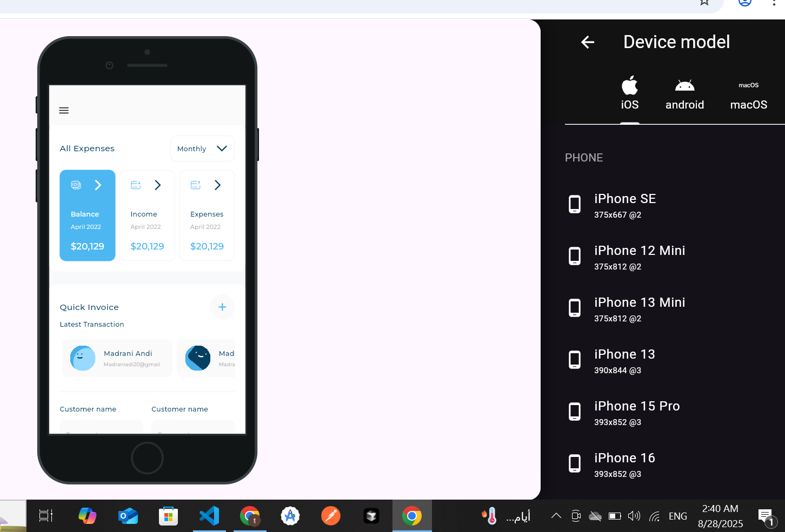

<!DOCTYPE html>
<html lang="en">
 
  
<body>

<h1>📊 Responsive UI Dashboard</h1>

Responsive Admin Dashboard built with <strong>Flutter</strong>, designed to work seamlessly on desktop 🖥️, tablet 📱, and mobile 📲.  
This README showcases features, screenshots, and project setup.

<h2>📸 Screenshots</h2>

  

    <h3>🖥️ Desktop</h3>
    
  

  

    <h3>📱 Tablet</h3>
    
  

  

    <h3>📲 Mobile</h3>
    
  

<h2>✨ Features</h2>
<ul>
  <li>Responsive layouts for all devices</li>
  <li>Beautiful dashboard UI with charts and analytics</li>
  <li>Navigation drawer and app bar design</li>
  <li>Clean and reusable Flutter widgets</li>
  <li>Supports dark/light themes</li>
</ul>

<h2>🛠️ Tech Stack</h2>
<ul>
  <li><strong>Flutter</strong> 3.x</li>
  <li><strong>Dart</strong></li>
  <li><strong>fl_chart</strong> for charts</li>
  <li><strong>flutter_svg</strong> for icons</li>
  <li><strong>Provider / Cubit</strong> for state management</li>
</ul>

<h2>📂 Project Structure</h2>
<pre>
lib/
├── main.dart
├── responsive/        # layout helpers & breakpoints
├── utils/             # colors, themes, constants
├── widgets/           # reusable UI components
└── screens/           # dashboard pages
</pre>

<h2>🚀 Getting Started</h2>
<ol>
  <li>Clone the repo:
    <pre>git clone https://github.com/yourusername/responsive_dashboard.git</pre>
  </li>
  <li>Install dependencies:
    <pre>flutter pub get</pre>
  </li>
  <li>Run the app:
    <pre>flutter run</pre>
  </li>
</ol>

<h2>📊 Dashboard Demo</h2>

Example chart integration using <code>fl_chart</code>:

<h2>📧 Contact</h2>

Made with ❤️ by <strong>Your Name</strong> 
<a href="https://github.com/yourusername">GitHub</a> |
<a href="mailto:yourmail@example.com">Email</a>

</body>
</html>

